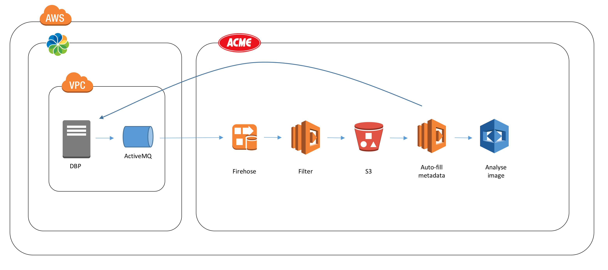
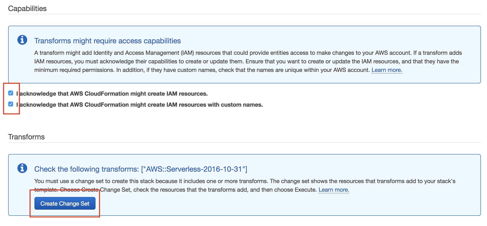
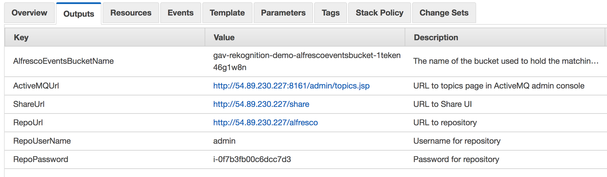
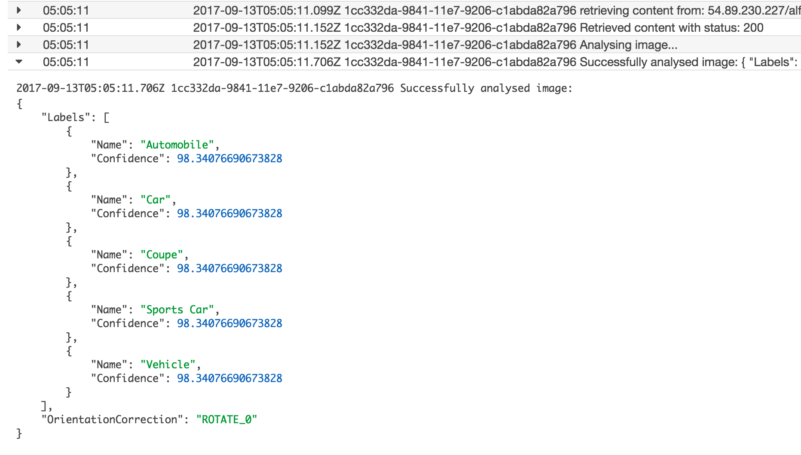
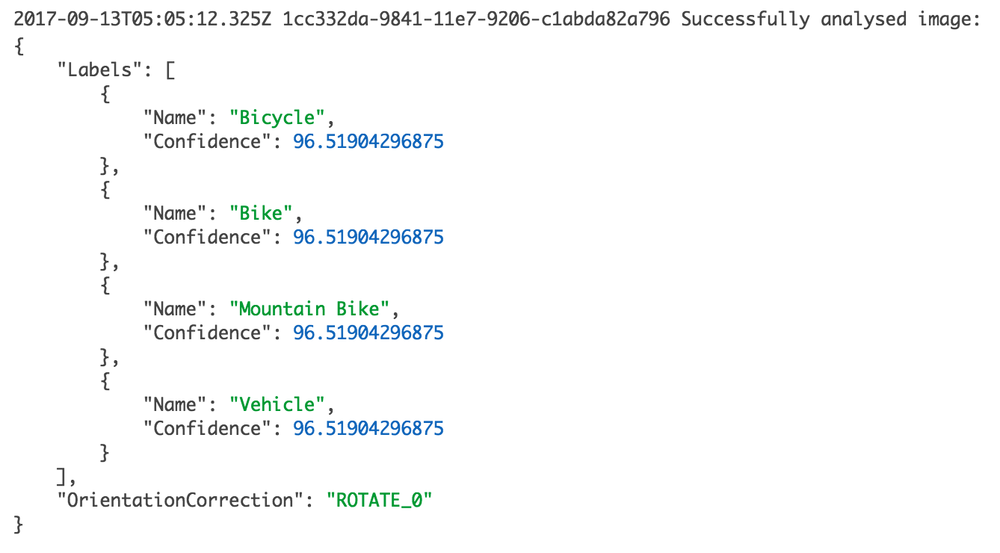
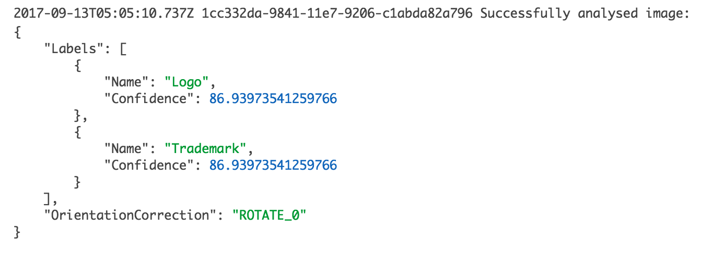
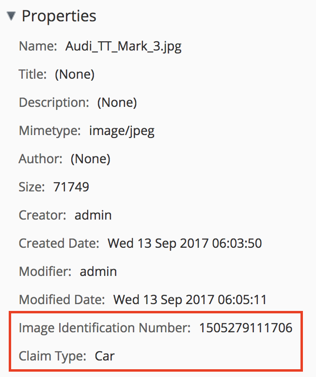
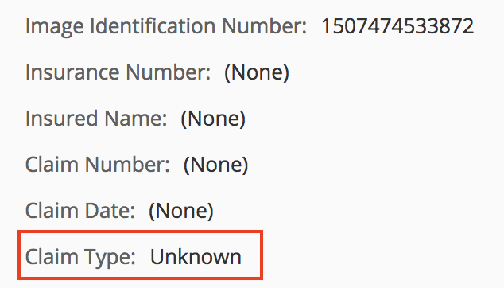

# Welcome

This repository contains a demonstration that processes [Alfresco](https://www.alfresco.com) events sent to [Kinesis Firehose](https://aws.amazon.com/kinesis/firehose/) and subsequently sends them to [Rekognition](https://aws.amazon.com/rekognition/) for analysis.

# Use Case

The demo uses a fictional use case around an insurance company. This insurance company only deals with vehicle insurance, more specifically, car, motorcycle and bicycle insurance. As images are uploaded into the system they are sent to Rekognition for analysis, the content type of the image is changed to a [custom type](https://github.com/gavincornwell/firehose-extension/blob/master/firehose-extension-platform-jar/src/main/resources/alfresco/module/firehose-extension-platform-jar/model/content-model.xml), acme:insuranceClaimImage, a unique is generated and the acme:claimType property set appropriately. If the image is not a car, motorcycle or bicylce the acme:missingClaimTypeProperty aspect is applied to flag the image for manual intervention.

This is achieved using the architecture shown in the diagram below:

# Pre-requisites

To run this demo some familiarality with Alfresco and AWS is presumed.

The [AWS CLI](http://docs.aws.amazon.com/cli/latest/userguide/installing.html) needs to be present and configured with a valid access ID/key and access to the AWC console is required.

# Package & Deploy

The whole demo stack is deployed in AWS using CloudFormation, in order to deploy the Lambda functions [AWS SAM](https://github.com/awslabs/serverless-application-model) is utilised, meaning a package function has to be run first. This packaging stage involves uploading the lambda code to an S3 bucket that resides in the same region as the stack will run. 

Login to the AWS console, select either Ireland or North Virginia as the region and create an S3 bucket for the code we'll package shortly.

Run the <code>package-cfn</code> script passing the name of the S3 bucket to upload the code to. This will generate a file named <code>cloud-formation-deploy.yaml</code>.

Navigate to the CloudFormation page in the AWS Console.

Press the "Create Stack" button, then select the "Upload a template to S3" option under the "Choose a template" section. Press the "Choose file" button and select the <code>cloud-formation-deploy.yaml</code> we just generated. Press "Next".

On the "Specify Details" page enter a name for the stack and fill out the parameters. The EC2 instance created needs to be in a VPC, ensure the selected "SubnetId" is within the selected "AvailablityZone" and in turn those are within the selected "VpcId" otherwise the stack will fail to deploy. Make sure you select a "KeyName" you have access to otherwise you won't be able to SSH to the repository server if the need arises. Press "Next".

Just skip the "Options" page by pressing the "Next" button.

On the "Review" page select both check-boxes in the "Capabilities" section and press the "Create Change Set" button in the "Transforms" section as shown below:

This will display a list of resources the CloudFormation stack will create, once that is visible press the "Execute" button.

Go and make yourself a coffee as it will take a few minutes for the stack to create and a further 10 minutes for the Alfresco Repository to be ready.

Once the stack is complete select the "Outputs" tab (shown in the screenshot below) to see all the information you'll need for accessing the system.

# Demo

Click on the link for the "ShareUrl" key shown in the CloudFormation "Outputs" tab. Login using the values of the "RepoUserName" and "RepoPassword" outputs.

Create a new Site and upload a few pictures, in the example shown below I've chosen an image that contains a car, one that contains a bicycle and the Alfresco logo.

It will take a couple of minutes for the events to make their way through the Kinesis Firehose stream (it [buffers data](http://docs.aws.amazon.com/firehose/latest/dev/create-configure.html), the minimum interval is 1 minute), get processed, added to S3 and analysed by Rekognition.

You can monitor the CloudWatch logs for the "&lt;stack-name&gt;ProcessImagesLambda-&lt;id&gt;" Lambda function to see when the processing is complete. The screenshot below shows a portion of the log for the image containing a car:

You can see that Rekognition returned the following labels; Automobile, Car, Coupe, Sports Car and Vehicle. You can control how many labels are returned via the <code>MaxLabels</code> and <code>MinConfidence</code> for this example they are set to 25 and 75, respectively.

The screenshot below shows what Rekognition returned for the bicycle image:

and finally, the labels returned for the logo image:

After being analysed by Rekognition the Lambda function uses the Alfresco REST API to set the appropriate metadata for the image.

Go back to Share, navigate to the folder where you uploaded the images and click on the image containing the car. Examine the properties of the image and you'll see it's type has been changed to <code>acme:insuranceClaimImage</code> as the custom properties are present as shown in the screenshot below:

A unique ID has been generated for the <code>acme:imageId</code> property and the <code>acme:claimType</code> property has been set appropriately. The same treatment has been given to the image containing the bicycle.

Now examine the properties for the Alfresco logo image. You'll see that the type has been converted as before but the <code>acme:claimType</code> property has been set to <code>Unknown</code> as shown in the screenshot below:

The updating of the metadata could be used to drive another process, for example, [SmartFolders](https://docs.alfresco.com/5.2/concepts/sf-whatis.html) could be used to categorise the images and highlight those that need to be manually processed.

# Troubleshooting

The [AMI used](https://aws.amazon.com/marketplace/pp/B06XHK6MNR?qid=1505364260789&sr=0-2&ref_=srh_res_product_title) by the CloudFormation stack is a 5.2 Enterprise Server, as such a trial license will be generated. Once your stack is over 30 days old the repository will go into read-only mode. If this happens either apply a valid license or re-create the stack.

If you need to SSH to the EC2 instance use <code>centos@&lt;public-ip&gt;</code>. You can get the public-ip from any of the URLs output by the CloudFormation template. Also, remember to use the SSH key selected when creating the stack!

The log files for the Repository and Share are located in <code>/var/log/tomcat-alfresco</code> and <code>/var/log/tomcat-share</code>, respectively. 

To see the events being processed on the repository add the following debug statements to <code>/usr/share/tomcat/shared/classes/alfresco/log4j.properties</code>:

    log4j.logger.org.alfresco.messaging.camel.routes.KinesisFirehoseRouteBuilder=debug
    log4j.logger.org.apache.camel.component.aws=debug
    log4j.logger.com.amazonaws.request=debug

Further configuration (including the name of the target Firehose stream) can be made in <code>/usr/share/tomcat/shared/classes/alfresco-global.properties</code>.

If you make any configuration changes you'll need to restart the Repository or Share Tomcat service, using <code>service tomcat-alfresco restart</code> or <code>service tomcat-share restart</code>, respectively. Note: you'll need to <code>sudo su</code> first.

If the EC2 instance is rebooted for any reason the ActiveMQ service will not restart automatically. To start it again follow these steps:
1. SSH into the EC2 instance
2. sudo su
3. cd /opt/apache-activemq-5.14.3/bin
4. ./activemq restart

To check that events are being emitted you can also examine the ActiveMQ admin console using the <code>ActiveMQUrl</code> output by the CloudFormation template. You should see the number highlighted in the screenshot below increasing after activity in Share.

If you're still having problems feel free to raise an [issue](https://github.com/gavincornwell/firehose-rekognition-demo/issues).

# Cleanup

When you're finished with the stack (you will be charged a small amount for the resources it uses) navigate to the CloudFormation console, select the stack you created and choose "Delete Stack" from the "Actions" menu.